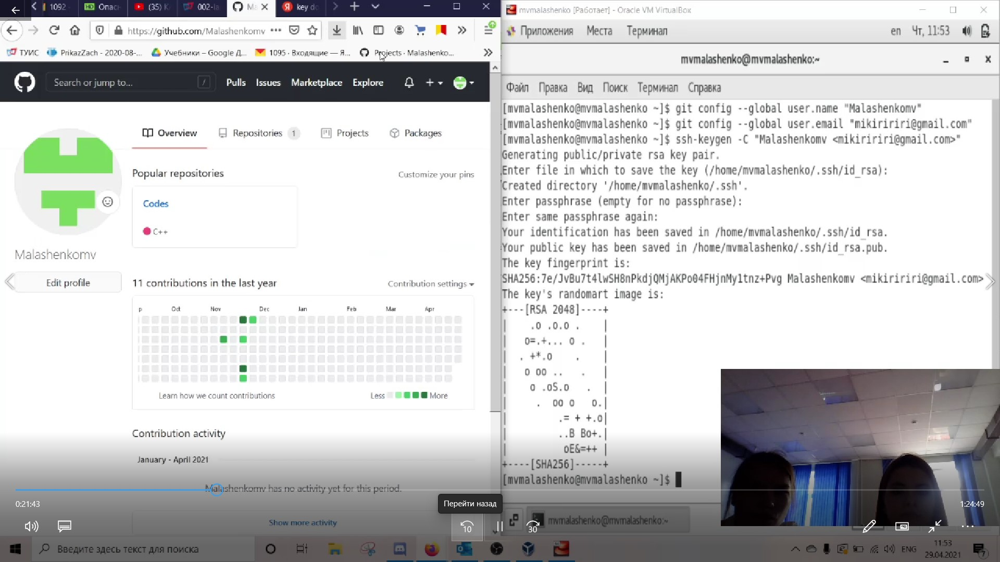
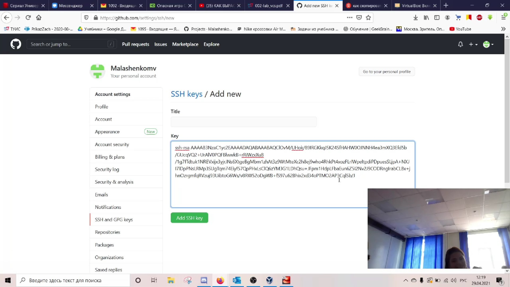

---
# Front matter
lang: ru-RU
title: "Отчёт по лабораторной работе №2"
subtitle: "Github"
author: "Малашенко Марина Владимировна"

# Formatting
toc-title: "Содержание"
toc: true # Table of contents
toc_depth: 2
lof: true # List of figures
lot: true # List of tables
fontsize: 12pt
linestretch: 1.5
papersize: a4paper
documentclass: scrreprt
polyglossia-lang: russian
polyglossia-otherlangs: english
mainfont: PT Serif
romanfont: PT Serif
sansfont: PT Sans
monofont: PT Mono
mainfontoptions: Ligatures=TeX
romanfontoptions: Ligatures=TeX
sansfontoptions: Ligatures=TeX,Scale=MatchLowercase
monofontoptions: Scale=MatchLowercase
indent: true
pdf-engine: lualatex
header-includes:
  - \linepenalty=10 # the penalty added to the badness of each line within a paragraph (no associated penalty node) Increasing the value makes tex try to have fewer lines in the paragraph.
  - \interlinepenalty=0 # value of the penalty (node) added after each line of a paragraph.
  - \hyphenpenalty=50 # the penalty for line breaking at an automatically inserted hyphen
  - \exhyphenpenalty=50 # the penalty for line breaking at an explicit hyphen
  - \binoppenalty=700 # the penalty for breaking a line at a binary operator
  - \relpenalty=500 # the penalty for breaking a line at a relation
  - \clubpenalty=150 # extra penalty for breaking after first line of a paragraph
  - \widowpenalty=150 # extra penalty for breaking before last line of a paragraph
  - \displaywidowpenalty=50 # extra penalty for breaking before last line before a display math
  - \brokenpenalty=100 # extra penalty for page breaking after a hyphenated line
  - \predisplaypenalty=10000 # penalty for breaking before a display
  - \postdisplaypenalty=0 # penalty for breaking after a display
  - \floatingpenalty = 20000 # penalty for splitting an insertion (can only be split footnote in standard LaTeX)
  - \raggedbottom # or \flushbottom
  - \usepackage{float} # keep figures where there are in the text
  - \floatplacement{figure}{H} # keep figures where there are in the text
---

# Цель работы:

Изучить идеологию и применение средств контроля версий.


# Ход работы

**1.** До выполнения лабораторной работы у меня уже была создана учетная запись на https://github.com/




- - -

**2.** Настройка локального репозитория git:
Создадим локальный репозиторий. Сначала сделаем предварительную конфигурацию, указав имя и email владельца репозитория:


- - -

**3.** Запросим SSH-ключ: (как видно на первом скриншоте - его пока нет)


- - -

**4.** Командой cat выводим ключ в нужном виде


Его не получится скопировать, не настроив общий буфер обмена между виртуальной машиной и ползовательской ОС.
Настройка двунаправавленного буфера:


- - -

**5.** Вводим ключ на сайт


Теперь терминал и гитхаб синхронизированы.
 




- - -

**6.** Далее для правильной синхронизации виртуальная машина должна быть подключена к интернету.
Создадим репозиторий “oper”


Создадим первый коммит, после него команда git push.


Можем увидеть, что он создался на сайте:


- - -

**7.** Первичная конфигурация: добавим лицензию


Шаблон игнорируемых файлов:


Добавим коммит:


Открылся текстовый редактор vi: для записи файла и выхода из редактора используем клавиши Esc : wq


- - -

**8.** Конфигурация git-flow
Для работы команды git flow init нужно установить пакет git-flow


Установка пакета:


Установим префикс для ярлыков vi:


- - -

**9.** Создание релиза:


И снова редактор vi:


Передадим релиз:


Создаем релиз:


- - -

## Вывод
Мы изучили идеологию и применение средств контроля версий.

- - -
## Контрольные вопросы

```1.``` Что такое системы контроля версий (VCS) и для решения каких задач они предназначаются? 
Система контроля версий (VCS) — это место хранения кода. Система управления версиями позволяет хранить несколько версий одного и того же документа, при необходимости возвращаться к более ранним версиям, определять, кто и когда сделал то или иное изменение, и многое другое. 
Такие системы наиболее широко используются при разработке программного обеспечения для хранения исходных кодов разрабатываемой программы. 

```2.``` Объясните следующие понятия VCS и их отношения: хранилище, commit, история, рабочая копия. 
Репозиторий - хранилище версий - в нем хранятся все документы вместе с историей их изменения и другой служебной информацией 
Commit («[трудовой] вклад», не переводится) — процесс создания новой версии 
Рабочая копия (working copy) — текущее состояние файлов проекта, основанное на версии, загруженной из хранилища (обычно на последней). 
Версия (revision), или ревизия, — состояние всех файлов на определенный момент времени, сохраненное в репозитарии, с дополнительной информацией 

```3.``` Что представляют собой и чем отличаются централизованные и децентрализованные VCS? Приведите примеры VCS каждого вида. 
Централизованные системы — это системы, которые используют архитектуру клиент / сервер, где один или несколько клиентских узлов напрямую подключены к центральному серверу. (Пример — Wikipedia.) 
В децентрализованных системах каждый узел принимает свое собственное решение. Конечное поведение системы является совокупностью решений отдельных узлов. (Пример — Bitcoin) 

```4.``` Опишите действия с VCS при единоличной работе с хранилищем.
 
```5.``` Опишите порядок работы с общим хранилищем VCS. 

```6.``` Каковы основные задачи, решаемые инструментальным средством git? 
У Git есть две основные задачи: хранить информацию обо всех изменениях в коде, начиная с самой первой строчки, и обеспечить удобства командной работы над кодом.
 
```7.``` Назовите и дайте краткую характеристику командам git. 
– создание основного дерева репозитория: git init – получение обновлений (изменений) текущего дерева из центрального репозитория: git pull – отправка всех произведённых изменений локального дерева в центральный репозиторий: git push – просмотр списка изменённых файлов в текущей директории: git status – просмотр текущих изменения: git diff – сохранение текущих изменений: – добавить все изменённые и/или созданные файлы и/или каталоги: git add . – добавить конкретные изменённые и/или созданные файлы и/или каталоги: git add имена_файлов – удалить файл и/или каталог из индекса репозитория (при этом файл и/или каталог остаётся в локальной директории): git rm имена_файлов – сохранение добавленных изменений: – сохранить все добавленные изменения и все изменённые файлы: git commit -am 'Описание коммита' – сохранить добавленные изменения с внесением комментария через встроенный редактор: git commit – создание новой ветки, базирующейся на текущей: git checkout -b имя_ветки – переключение на некоторую ветку: git checkout имя_ветки (при переключении на ветку, которой ещё нет в локальном репозитории, она будет создана и связана с удалённой) – отправка изменений конкретной ветки в центральный репозиторий: git push origin имя_ветки – сл ияние ветки с текущим деревом: git merge —no-ff имя_ветки – удаление ветки: – удаление локальной уже слитой с основным деревом ветки: git branch -d имя_ветки – принудительное удаление локальной ветки: git branch -D имя_ветки – удаление ветки с центрального репозитория: git push origin :имя_ветки 

```9.``` Что такое и зачем могут быть нужны ветви (branches)? 
‘Git branch’ – это команда для управления ветками в репозитории Git. 
Ветка – это просто «скользящий» указатель на один из коммитов. Когда мы создаём новые коммиты, указатель ветки автоматически сдвигается вперёд, к вновь созданному коммиту. 
Ветки используются для разработки одной части функционала изолированно от других. Каждая ветка представляет собой отдельную копию кода проекта. Ветки позволяют одновременно работать над разными версиями проекта. 
Ветвление («ветка», branch) — один из параллельных участков истории в одном хранилище, исходящих из одной версии (точки ветвления). Ветки нужны для того, чтобы программисты могли вести совместную работу над проектом и не мешать друг другу при этом. 

10. Как и зачем можно игнорировать некоторые файлы при commit? 
Игнорируемые файлы обычно представляют собой файлы, специфичные для платформы, или автоматически созданные из сборочных систем. Временно игнорировать изменения в файле можно командой: git update-index —assume-unchanged <file>
