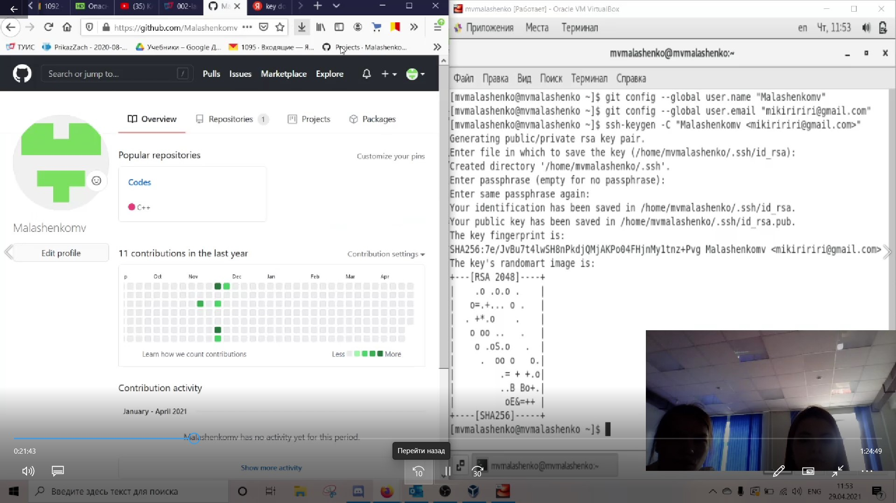
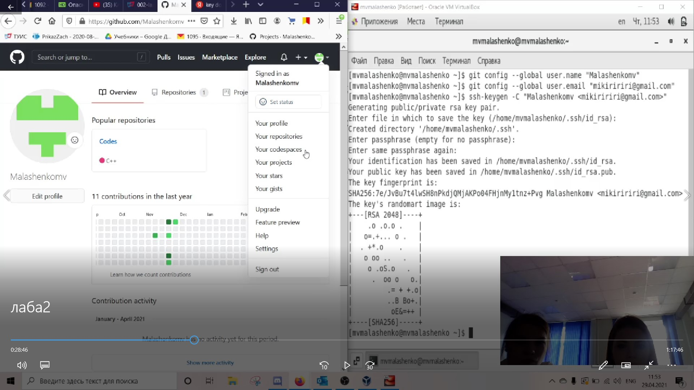
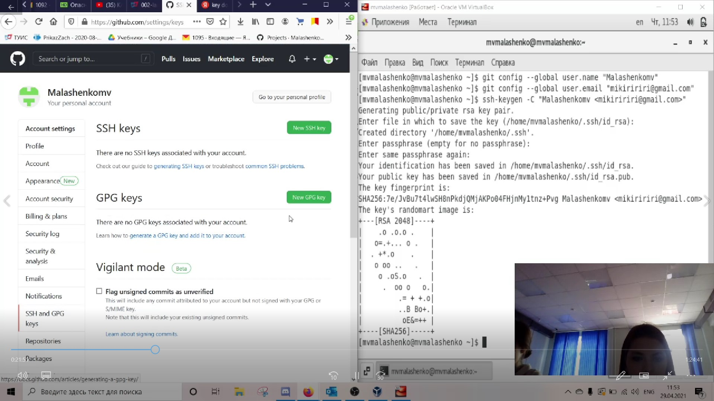
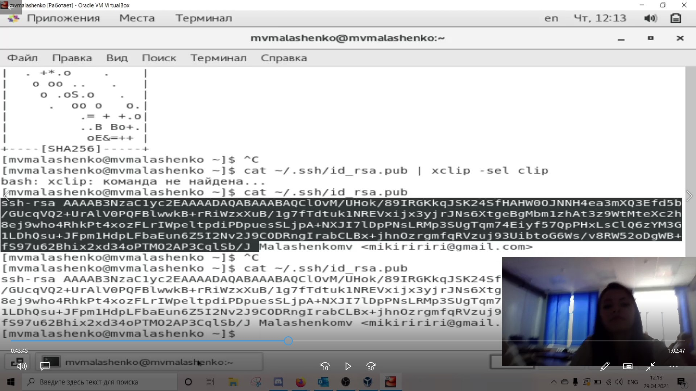
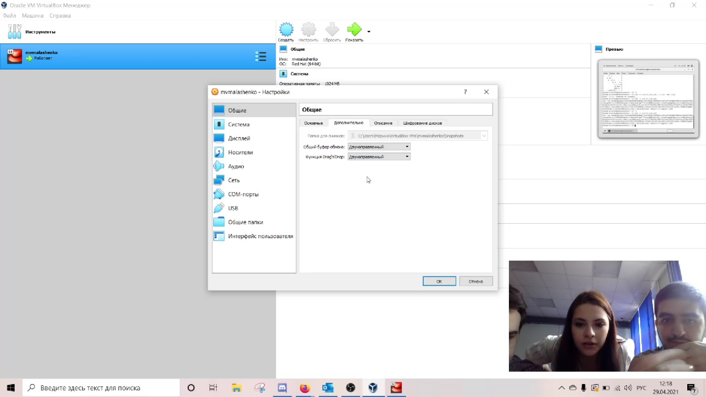
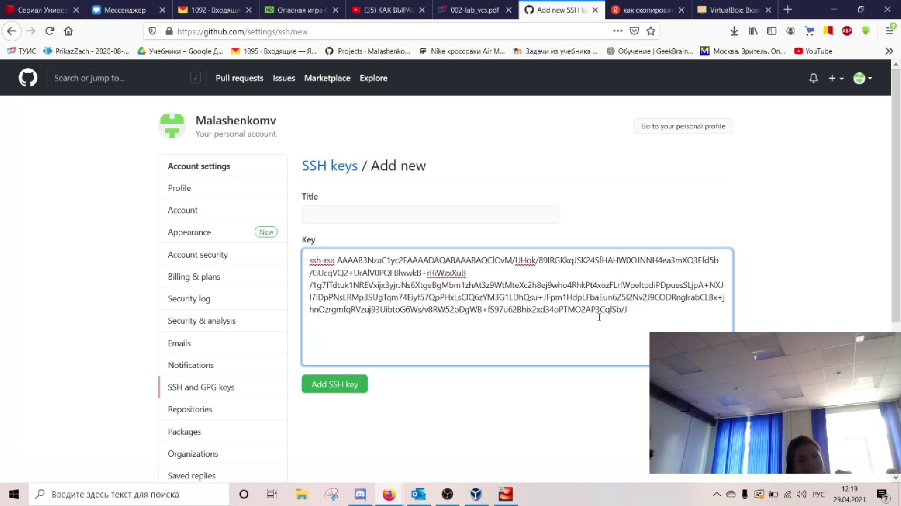

---
# Front matter
lang: ru-RU
title: "Отчёт по лабораторной работе №3"
subtitle: "Markdown"
author: "Малашенко Марина Владимировна"

# Formatting
toc-title: "Содержание"
toc: true # Table of contents
toc_depth: 2
lof: true # List of figures
lot: true # List of tables
fontsize: 12pt
linestretch: 1.5
papersize: a4paper
documentclass: scrreprt
polyglossia-lang: russian
polyglossia-otherlangs: english
mainfont: PT Serif
romanfont: PT Serif
sansfont: PT Sans
monofont: PT Mono
mainfontoptions: Ligatures=TeX
romanfontoptions: Ligatures=TeX
sansfontoptions: Ligatures=TeX,Scale=MatchLowercase
monofontoptions: Scale=MatchLowercase
indent: true
pdf-engine: lualatex
header-includes:
  - \linepenalty=10 # the penalty added to the badness of each line within a paragraph (no associated penalty node) Increasing the value makes tex try to have fewer lines in the paragraph.
  - \interlinepenalty=0 # value of the penalty (node) added after each line of a paragraph.
  - \hyphenpenalty=50 # the penalty for line breaking at an automatically inserted hyphen
  - \exhyphenpenalty=50 # the penalty for line breaking at an explicit hyphen
  - \binoppenalty=700 # the penalty for breaking a line at a binary operator
  - \relpenalty=500 # the penalty for breaking a line at a relation
  - \clubpenalty=150 # extra penalty for breaking after first line of a paragraph
  - \widowpenalty=150 # extra penalty for breaking before last line of a paragraph
  - \displaywidowpenalty=50 # extra penalty for breaking before last line before a display math
  - \brokenpenalty=100 # extra penalty for page breaking after a hyphenated line
  - \predisplaypenalty=10000 # penalty for breaking before a display
  - \postdisplaypenalty=0 # penalty for breaking after a display
  - \floatingpenalty = 20000 # penalty for splitting an insertion (can only be split footnote in standard LaTeX)
  - \raggedbottom # or \flushbottom
  - \usepackage{float} # keep figures where there are in the text
  - \floatplacement{figure}{H} # keep figures where there are in the text
---

# Цель работы:

Научиться оформлять отчёты с помощью легковесного языка разметки Markdown.

# Ход работы

**1.** Для начала я открыла отчет прошлой лабораторной работы, сделанный в Word.

- - -

**2.** Далее сохранила все изображения из него в папку screen, которая должна находиться рядом с файлом будущего маркдаун-отчета.

- - -

**3.** Для примера отчета использовался шаблон Дмитрия Сергеевича с github. 
Код я редактировала в программе Visual Studio Code, так как в нем можно удобно отслеживать изменения.
Оформила различные заголовки в соотвествии с теоретическим комментарием лабораторной работы, использовала различные выделения текста и нумерованные списки.

- - -

**4.** Данный файл сохраняется с расширением .md и загружается на github.

- - -

**5.** Затем для обработки файлов в формате Markdown будем использовать Pandoc https://pandoc.org/. 

Конкретно, нам понадобится программа pandoc,pandoc-citeproc  https://github.com/jgm/pandoc/releases,pandoc-crossrefhttps://github.com/lierdakil/pandoc-crossref/releases.

Преобразовать файл README.md можно следующим образом: pandoc README.md -o README.pdf

или так 

pandoc README.md -o README.docx

 

- - -

## Вывод
Я научилась оформлять отчёты с помощью легковесного языка разметки Markdown.

- - -
## Контрольные вопросы 
(Не предусмотрены в данной лабораторной работе)

