-—
# Front matter
lang: ru-RU
title: "Отчёт по лабораторной работе №5"
subtitle: "Основы интерфейса взаимодействия пользователя с системой Unix на уровне командной строки"
author: "Малашенко Марина Владимировна"

# Formatting
toc-title: "Содержание"
toc: true # Table of contents
toc_depth: 2
lof: true # List of figures
lot: true # List of tables
fontsize: 12pt
linestretch: 1.5
papersize: a4paper
documentclass: scrreprt
polyglossia-lang: russian
polyglossia-otherlangs: english
mainfont: PT Serif
romanfont: PT Serif
sansfont: PT Sans
monofont: PT Mono
mainfontoptions: Ligatures=TeX
romanfontoptions: Ligatures=TeX
sansfontoptions: Ligatures=TeX,Scale=MatchLowercase
monofontoptions: Scale=MatchLowercase
indent: true
pdf-engine: lualatex
header-includes:
- \linepenalty=10 # the penalty added to the badness of each line within a paragraph (no associated penalty node) Increasing the value makes tex try to have fewer lines in the paragraph.
- \interlinepenalty=0 # value of the penalty (node) added after each line of a paragraph.
- \hyphenpenalty=50 # the penalty for line breaking at an automatically inserted hyphen
- \exhyphenpenalty=50 # the penalty for line breaking at an explicit hyphen
- \binoppenalty=700 # the penalty for breaking a line at a binary operator
- \relpenalty=500 # the penalty for breaking a line at a relation
- \clubpenalty=150 # extra penalty for breaking after first line of a paragraph
- \widowpenalty=150 # extra penalty for breaking before last line of a paragraph
- \displaywidowpenalty=50 # extra penalty for breaking before last line before a display math
- \brokenpenalty=100 # extra penalty for page breaking after a hyphenated line
- \predisplaypenalty=10000 # penalty for breaking before a display
- \postdisplaypenalty=0 # penalty for breaking after a display
- \floatingpenalty = 20000 # penalty for splitting an insertion (can only be split footnote in standard LaTeX)
- \raggedbottom # or \flushbottom
- \usepackage{float} # keep figures where there are in the text
- \floatplacement{figure}{H} # keep figures where there are in the text
--—
-—


# Цель работы

Приобрести практические навыки взаимодействия пользователя с системой посредством командной строки.

# Ход работы

**1.** Определите полное имя вашего домашнего каталога. 
Далее относительно этого каталога будут выполняться последующие упражнения.
 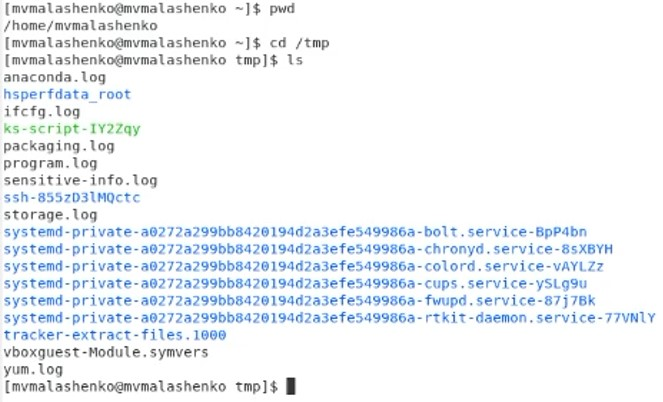
**2.** Выполните следующие действия:
**2.1.** Перейдите в каталог/tmp.
 
**2.2.** Выведите на экран содержимое каталога/tmp. 
Для этого используйте команду ls с различными опциями. Поясните разницу в выводимой на экран информации.
-a- Отображать все файлы, включая скрытые, это те, перед именем которых стоит точка;
-F- Добавить специальные символы к именам файлов, которые показывают, что это за файл. 
-l- Вывод в длинном формате: перед именами файлов выдается режим доступа, количество ссылок на файл, имена владельца и группы, размер в байтах и время последней модификации (см. ниже). Если файл является специальным, то в поле размера выводится старший и младший номера устройства.
 
 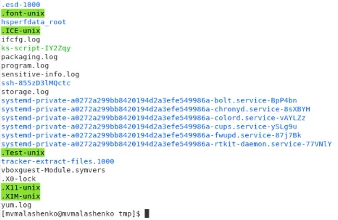
 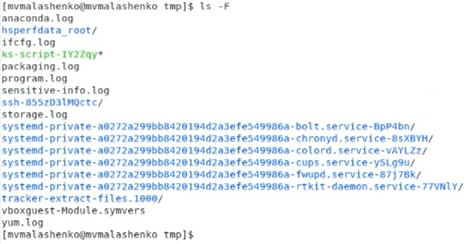
 
 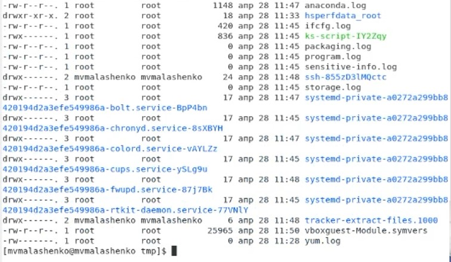
**2.3.** Определите, есть ли в каталоге/var/spool подкаталог с именем cron?
 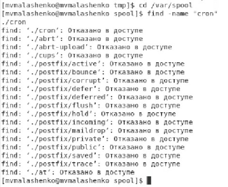
 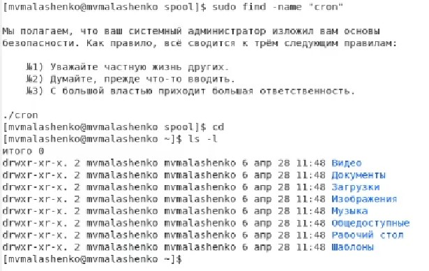
**2.4.** Перейдите в Ваш домашний каталог и выведите на экран его содержимое. Определите, кто является владельцем файлов и подкаталогов?
 Владелец файлов mvmalashenko
 
**3.** Выполните следующие действия:
**3.1.** В домашнем каталоге создайте новый каталог с именем newdir.
**3.2.** В каталоге~/newdir создайте новый каталог с именем morefun.
 
**3.3.** В домашнем каталоге создайте одной командой три новых каталога с именами letters, memos, misk. Затем удалите эти каталоги одной командой.
  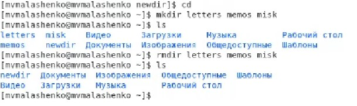
**3.4.** Попробуйте удалить ранее созданный каталог~/newdir командой rm. Проверьте, был ли каталог удалён.
Каталог удален не был, т. к. в нем содержится еще один каталог.
  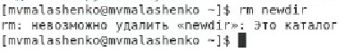
**3.5.** Удалите каталог~/newdir/morefun из домашнего каталога. Проверьте, был ли каталог удалён.
   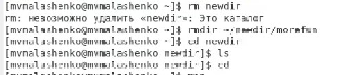
**4.** С помощью команды man определите, какую опцию команды ls нужно использовать для просмотра содержимое не только указанного каталога, но и подкаталогов, входящих в него.
 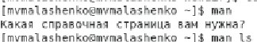
 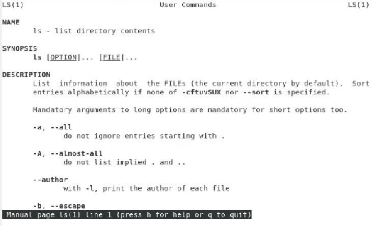

**5.** С помощью команды man определите набор опций команды ls, позволяющий отсортировать по времени последнего изменения выводимый список содержимого каталога с развёрнутым описанием файлов.
 

**6.** Используйте команду man для просмотра описания следующих команд: cd, pwd, mkdir, rmdir, rm. Поясните основные опции этих команд.
 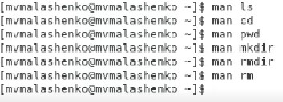
 
```Опции cd :```
-L Переходить по символическим ссылкам. Данное поведение используется по умолчанию.
-P Разыменовывать символические ссылки. В данном случае, если осуществляется переход на символическую ссылку, которая указывает на директорию, то в результате команда cd изменит текущую рабочую директорию на директорию, указанную в качестве параметра (то есть ссылка будет разыменованна).
  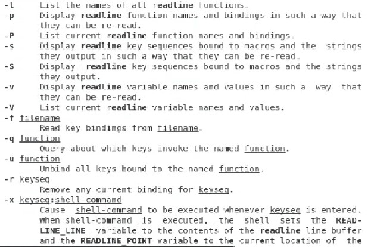
  
```Опции pwd:```
-L, --logical – брать директорию из переменной окружения, даже если она содержит символические ссылки; 
-P – отбрасывать все символические ссылки; 
--help – отобразить справку по утилите; 
--version – отобразить версию утилиты.
  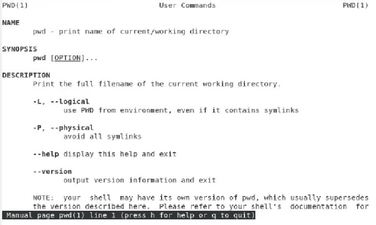
  
```Опции mkdir: ```
-m режим доступа явное задание режима доступа для создаваемых каталогов
-p При указании этой опции перед созданием нового каталога предварительно создаются все несуществующие вышележащие каталоги.
  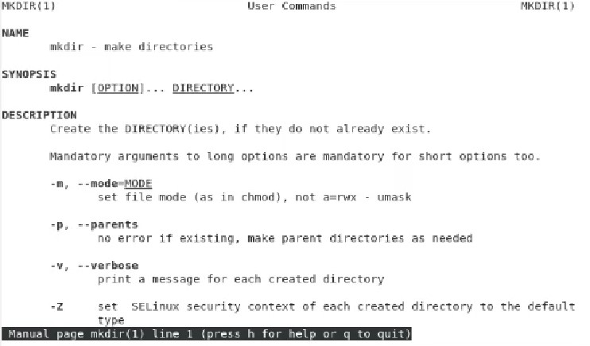
 
```Опции rmdir:```
/S – Удаление дерева каталогов, т. е. не только указанного каталога, но и всех содержащихся в нем файлов и подкаталогов. 
/Q- Отключение запроса подтверждения при удалении дерева каталогов с помощью ключа /S.
  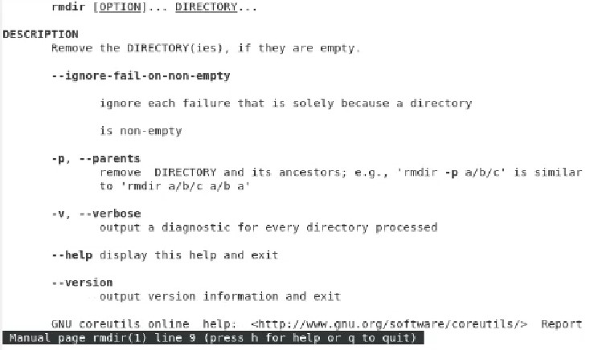
 
```Опции rm: ```
-f или —force Игнорировать несуществующие файлы и аргументы. Никогда не выдавать запросы на подтверждение удаления. 
-i Выводить запрос на подтверждение удаления каждого файла. 
-I Выдать один запрос на подтверждение удаления всех файлов, если удаляется больше трех файлов или используется рекурсивное удаление. Опция применяется, как более «щадящая» версия опции -i 
–-interactive [=КОГДА] Вместо КОГДА можно использовать: never — никогда не выдавать запросы на подтверждение удаления. once — выводить запрос один раз (аналог опции -I). always — выводить запрос всегда (аналог опции -i). Если значение КОГДА не задано, то используется always 
--one-file-system Во время рекурсивного удаления пропускать директории, которые находятся на других файловых системах. 
--no-preserve-root Если в качестве директории для удаления задан корневой раздел /, то считать, что это обычная директория и начать выполнять удаление. 
--preserve-root Если в качестве директории для удаления задан корневой раздел /, то запретить выполнять команду rm над корневым разделом. Данное поведение используется по умолчанию.
 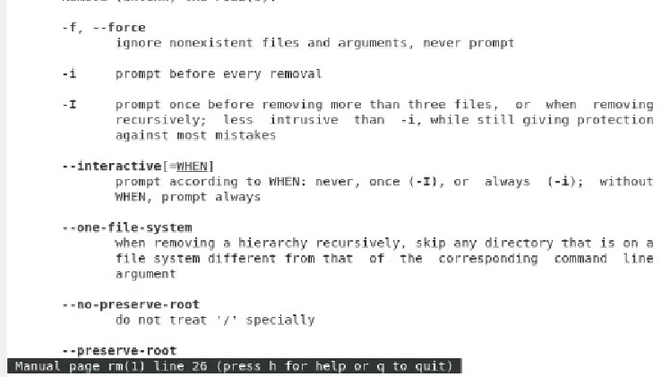
 
**7.** Используя информацию, полученную при помощи команды history, выполните модификацию и исполнение нескольких команд из буфера команд.
  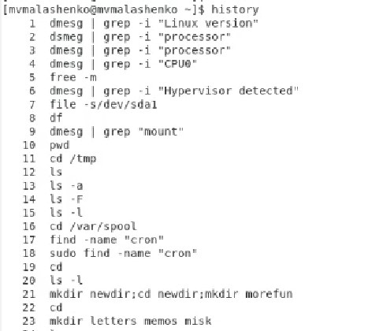
  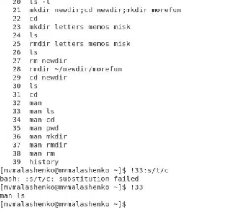
После этого нам вывело справку об ls.


# Вывод
Мы приобрели практические навыки взаимодействия пользователя с системой посредством командной строки.

## Ответы на контрольные вопросы
*1. Что такое командная строка?*

**Ответ:** Командная строка (консоль или Терминал) – это специальная программа, которая позволяет управлять компьютером путем ввода текстовых команд с клавиатуры. 

*2.При помощи какой команды можно определить абсолютный путь текущего каталога? Приведите пример.*

**Ответ:** При помощи команды realpath можно определить абсолютный путь текущего каталога. Например, если вбить realpath var на экран выведется /home/<username>/var. 

*3.При помощи какой команды и каких опций можно определить только тип файлов и их имена в текущем каталоге? Приведите примеры.*

**Ответ:** При помощи команды ls -F можно определить только тип файлов и их имена в текущем каталоге. 

*4.Какие файлы считаются скрытыми? Как получить информацию о скрытых файлах? Приведите примеры.*

**Ответ:** Файл считается скрытым, если его название начинается с символа точка «.». Например, «.myfile». Обычно такие файлы используются приложениями для хранения настроек, конфигураций и другой информации, которую нужно скрыть от пользователя 

*5.При помощи каких команд можно удалить файл и каталог? Можно ли это сделать одной и той же командой? Приведите примеры.*
**Ответ:** При помощи команд rm и rmdir можно удалить файл и каталог. Это нельзя сделать одной и той же командой. rmdir используется, чтобы удалить файлы, которые должны быть пустые. rm используется, чтобы удалить непустые файлы или целые деревья каталогов. 

*6. Как определить, какие команды выполнил пользователь в сеансе работы?*

**Ответ:** При помощи команды history. 

*7. Каким образом можно исправить и запустить на выполнение команду, которую пользователь уже использовал в сеансе работы? Приведите примеры.*

**Ответ:** С помощью следующей команды: !<номер_команды>:s/<что_меняем>/<на_что_меняем> 
Например: 
history 
3 ls -a . 
!3:s/a/F 
ls -F 

*8. Можно ли в одной строке записать несколько команд? Если да, то как? Приведите примеры*
**Ответ:** В одной строке можно записать несколько команд. Если требуется выполнить последовательно несколько команд, записанный в одной строке, то для этого используется символ точка с запятой. Пример: cd; ls. 

*9. Что такое символ экранирования? Приведите примеры использования этого символа.*

**Ответ:** Экранирование — это способ заключения в кавычки одиночного символа. Экранирующий символ (\) сообщает интерпретатору, что следующий за ним символ должен восприниматься как обычный символ. Пример: 
echo "Привет" # Привет 
echo "Он сказал: \"Привет\"." # Он сказал: "Привет". 


*10. Какая информация выводится на экран о файлах и каталогах, если используется опция l в команде ls?*

**Ответ:** Если используется опция l в команде ls, то на экран выводится подробный список, в котором будет отображаться владелец, группа, дата создания, размер и другая информация о файлах и каталогах. 

*11. Что такое относительный путь к файлу? Приведите примеры использования относительного и абсолютного пути при выполнении какой-либо команды.*

**Ответ:** Относительный путь – это путь к файлу относительно текущей папки. При использовании команды pwd на экран выведется относительный путь текущей директории, а при использовании команды realpath на экран выведется абсолютный путь текущей директории. 

*12. Как получить информацию об интересующей вас команде?*

**Ответ:** С помощью команды man. 

*13. Какая клавиша или комбинация клавиш служит для автоматического дополнения вводимых команд.*

**Ответ:** Команда "Alt+?" позволяет вывести все варианты дополнения.